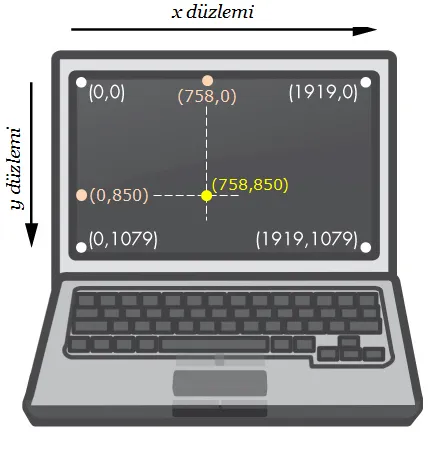
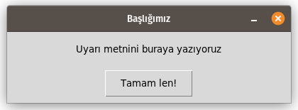
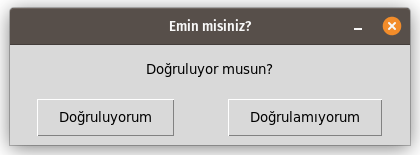
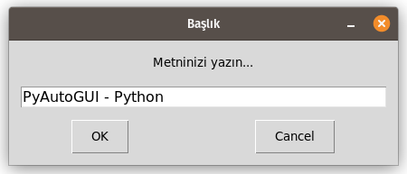
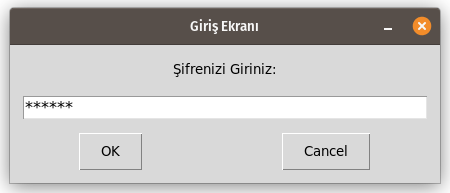

**PyAutoGUI**, fare ve klavyeleri kontrol etmemizi sağlayan, böylece otomatik görevler yapan kodlar/botlar yazmamıza yardımcı olan güzel, faydalı bir Python kütüphanesidir/modülüdür.

**PyAutoGUI** kütüphanesi ile aşağıda listelenen işlemleri yapabiliriz;

* İmleci hareket ettirme,
* İstenilen yere tek, çift ya da daha fazla tıklama,
* Pencere, diyalog kutusu taşıma, kaydırma çubuğunu  hareket ettirme,
* Klavyeden yazı yazma, Ekrandaki metnin bir bölümü ya da tamamını seçme,
* Komut gönderme,
* Ekran görüntüsü alma,
* Ekran görüntüsüne sahip olduğumuz buton, pencere ve simgeleri bulma ve tıklama.

**PyAutoGUI** kütüphanesini indirme/yükleme konusunda [bu adresten](https://pypi.org/project/PyAutoGUI/) ya da [şu adresten](https://github.com/asweigart/pyautogui) bilgi alabilirsiniz.

## Pip Yüklemek;

**Pip**, python kütüphanelerini barındıran bir paket yönetim sistemidir. Paket
 yönetim sistemi ise, geliştiriciler tarafından hazırlanan o dile ya da yazılıma ait kütüphaneleri / modülleri tek komut kullanarak kolayca yükleyebilmenizi, güncelleyebilmenizi ve isterseniz silebilmenizi sağlayan araçtır.

Eğer bilgisayarınızda **pip** yüklü değilse öncelikle **pip3**'ü yüklemelisiniz. 

```python
sudo apt-get install python3-pip
```

## PyAutoGUI kütüphanesini yüklemek;

### Windows Kullanıcısı;

Windows işletim sistemi kullanıyorsanız PyAutoGUI kütüphanesini yüklemek için aşağıdaki komutu, komut satırına yazmalısınız.

```python
C:\Python34\pip.exe install pyautogui
```

### Linux Kullanıcısı;

Linux işletim sistemi kullanıyorsanız PyAutoGUI kütüphanesini yüklemek için aşağıdaki komutu, terminale  yazmalısınız.

```python
pip3 install python3-xlib
sudo apt-get install scrot
sudo apt-get install python3-tk
sudo apt-get install python3-dev
pip3 install pyautogui
```

# Genel Fonksiyonlar;

Öncelikle **pyautogui** modülünü, çalışmamıza dahil (import) edelim.

```python
import pyautogui
```

## size()

Ekran Boyutunu öğrenelim.

```python
print(pyautogui.size())  
```

> Çıktı:
> 
> ```python
> Size(width=1920, height=1080)
> ```

## onScreen(x, y)

Belirttiğimiz (0, 3000) Koordinatları, ekran sınırları içerisinde mi? Öğrenelim.

```python
print(pyautogui.onScreen(0, 3000))
```

> Çıktı
> 
> ```python
> False
> ```

## UYARI:

PyAutoGUI kütüphanesini kullanırken, koordinatlar hakkında bilmeniz gereken bir husus var. Fare kontrolü yapabilmemiz için ekrandaki koordinat sistemini anlayabilmemiz gerekir.

Bu koordinat sistemi `X` (yatay) ve `Y` (dikey) düzlemlerden oluşmaktadır.

Başlangıç Koordinatı olan (0, 0) noktası (Orijin), Ekranın sol üst kısmıdır. `X` ekseni sağa doğru artarken, `Y` ekseni aşağı yönde artış gösterir.



# Fare Hareketi Fonksiyonları;

## position()

İmleç konumunu tespit et, **x** ve **y** değerlerini al, "a" ve "b" değişkenlerine ata. Değişkenleri ekrana yazdır.

```python
a, b = pyautogui.position()
print(a, b)
```

> Çıktı:
> 
> ```python
> 1583 259
> ```

İmleç konumunu doğrudan ekrana yazdır;

```python
print(pyautogui.position())
```

> Çıktı;
> 
> ```python
> Point(x=1577, y=229)
> ```

## displayMousePosition()

Bu fonksiyon, İmleç koordinatlarını eş zamanlı şekilde konsolda görüntüler. Ayrıca imleçin bulunduğu konumun RGB renk kodunu da görüntüler. Komuttan çıkmak için, imleç konsoldayken  `Ctrl + C` tuşlarına basmalısınız.

```python
pyautogui.displayMousePosition()
```

> Çıktı
> 
> ```python
> Press Ctrl-C to quit.
> X: 1018 Y:  991 RGB: ( 62,  68,  80)
> ```

## moveTo(x, y)

İmleci X'te 100 ve Y'de 200 konumuna taşı.

```python
pyautogui.moveTo(100, 200)
```

İmleci X'te sabit tut ve Y'de 500 konumuna taşı.

```python
pyautogui.moveTo(x, 500)
```

İmleci X'te 600  konumuna taşı, Y'de mevcut (500 konumunda) sabit tut.

```python
pyautogui.moveTo(600, x)
```

imleci 2 saniye süre içinde X'te 100, Y'de 200 koordinatlarına taşı.

```python
pyautogui.moveTo(100, 200, 2)
```

## moveRel(x, y)

İmleci **mevcut bulunduğu konumdan** 50 pixel sağa (x ekseni yönünde) taşı

```python
pyautogui.moveRel(50, 0)
```

İmleci (fareyi) bulunduğu konumdan 50 pixel sola (-x ekseni yönünde) taşı

```python
pyautogui.moveRel(-50, 0)
```

## dragTo(x, y, button="right/left")

Farenin **sol tuşuna** basılı tutarak imleci X'te 750, Y'de 200 piksel konumuna sürükle-bırak. Sürükle-bırak işlemi yapar.

```python
pyautogui.dragTo(750, 200, button="left")
```

 Farenin **sağ tuşuna** basılı tutarak **2 saniye içinde** imleci bulunduğu konumdan 30 pixel sağa sürükle.

```python
pyautogui.dragRel(30, 0, 2, button="right")
```

## dragRel(x,y)

Farenin **sol tuşuna** basılı tutarak imleci **mevcut bulunduğu konumdan** X'te 150 sağa, Y'de 200 piksel yukarı sürükle-bırak.

```python
pyautogui.dragRel(150,-200)
```

**duration** parametresi ile, sürükle-bırak işleminin kaç saniye içerisinde yapılması gerektiğini belirtebilirsiniz. 

```python
pyautogui.dragRel(-150,200,duration=3)
```

## click()

Hiç bir parametre girilmeden çalıştırılırsa bulunduğu konumda **farenin sol butonu** ile bir kez tıklar.

```python
pyautogui.click()
```

## click(x, y)

x'te 100, y'de 200 koordinatlarına git ve sonra sol tıkla.

```python
pyautogui.click(x=100, y=200)
```

## click(button='right')

Bulunduğu konumda ****farenin sağ butonu** ile tıklar. Bunun için **rightClick(x, y)** komutu da kullanılabilir. Bu komut aşağıda anlatıldı.

```python
pyautogui.click(button='right') 
```

## click(clicks=...)

**Farenin sol butonu** ile birden fazla tıklar. Çift (iki kez) tıklamak için **doubleClick(x, y)** metodu da kullanılabilir. **doubleClick()** metodu aşağıda anlatıldı.

```python
pyautogui.click(clicks=2)
```

## click(interval=...)

**Farenin sol butonu** ile çift tıklarken, tıklamalar arasında 0.25sn süre ile bekler.

```python
pyautogui.click(clicks=2, interval=0.25)
```

 **Farenin sağ butonu** ile üç kez tıklarken, tıklamalar arasında 0.25sn süre ile bekler. 

```python
pyautogui.click(button="right", clicks=3, interval=0.25)
```

## click("resim.png")

**click()** metodunun bir başka kullanım yöntemi de, bir görseli referans olarak belirterek, o görselin koordinatlarını otomatik olarak belirleyip o koordinata tıklamasıdır. Bunu aşağıdaki kod ile basit bir şekilde gerçekleştirebiliriz.

```python
click("begen.png")
```

Referans resme sağ tıklamak için;

```python
pyautogui.click("link.png", button="right")
```

**PyAutoGUI** kütüphanesini referans resimler/grafikler ile kullanırken dikkat etmemiz gerekir. Kodları yazdığımız bilgisayar ile kodu/uygulamayı kullanacağımız bilgisayarın  ekran çözünürlüklerinin farklı olması halinde, referans resimlere ait görselleri uygulamayı kullanacağımız bilgisayarda yeniden almamız gerekir. Zira referans görüntülerdeki ufak değişiklikler bile kütüphane için olumsuz sonuçlar verecektir. 
Ayrıca ekranda referans görüntünün bir benzerinin olmaması gerekir. Aksi taktirde yanlış koordinat elde edilir ve istediğimizden farklı bir koordinata tıklanarak yanlış sonuç elde edebiliriz.

## rightClick(x, y)

İstenilen (örneğin 650, 550) konuma gidip **farenin sağ butonuna** tıkla.

```python
pyautogui.rightClick(650, 550)
```

## middleClick(x, y)

İstenilen (örneğin 500, 1000) konuma gidip **farenin orta butonuna** tıkla.

```python
middleClick(500, 1000)
```

## doubleClick(x, y)

İstenilen (örneğin 100, 200) konuma gidip **farenin sol butonuna çift** tıkla.

```python
pyautogui.doubleClick(100, 200)
```

## tripleClick(x, y)

İstenilen (örneğin 300, 600) konuma gidip **farenin sol butonuna üç kez** tıkla.

```python
pyautogui.tripleClick(300, 600)
```

## mouseDown() / mouseUp()

**Farenin sol butonuna** bas (mouseDown()) ve elini butondan çek (mouseUp())  

```python
pyautogui.mouseDown(); pyautogui.mouseUp()
```

## mouseDown(x, y, button="left/right")

**Farenin sağ / sol / orta butonuna** bas,  çek komutu gelmeden butonu bırakma. Kopyalamak amacıyla **Metin seçimi yaparken** kullanabileceğimiz bir fonksiyon.

```python
pyautogui.mouseDown(864, 486, button="left")
pyautogui.mouseUp(864, 864, button="left")
```

## mouseDown(button='right / left / middle')

Farenin Sağ / Sol / Orta butona bas.

```python
pyautogui.mouseDown(button='right')
```

## mouseUp(x, y, button='right / left / middle')

(100,200) koordinatlarına gittikten sonra farenin sağ butonuna basmayı bırak. Bu fonksiyon, Metin seçimi yaparken, seçimin nerede bitmesi gerektiğini belirtirken kullanılabilir.

```python
pyautogui.mouseUp(button='right', x=100, y=200)
```

Parametreler yer değiştirebilir. Aynı kod aşağıdaki şekilde de yazılabilir;

```python
pyautogui.mouseUp(x=100, y=200, button='right')
```

## scrool(...)

Sayfada kaydırma işlemi yapar. Fare tekerini 5 kez yukarı (ileri) hareket ettirelim.

```python
pyautogui.scroll(5)
```

Kodu çalıştırdığımızda öncelikle imlec (1750, 400) konumuna gidip bir kez sol tıklasın ardından fare tekerini 50 kez aşağı (geri/kendimize) doğru hareket ettirsin.

```python
pyautogui.moveTo(1750,400)
pyautogui.click()
pyautogui.scroll(-50)
```

# Klavye Kontrol Fonksiyonları;

## typewrite('...')

İmlecin bulunduğu konuma, anında "Merhaba Dünya" yazdırır.

```python
pyautogui.typewrite('Merhaba Dünya!')
```

Karakterler arası çeyrek (0.25) saniye bekleyerek "Merhaba Dünya" yazar.

```python
pyautogui.typewrite("Merhaba Dunya!", interval=0.25)
```

## KEYBOARD_KEYS

Özel tuşların listesine ulaşmak için aşağıdaki kodu çalıştırabilirsiniz.

```python
print(pyautogui.KEYBOARD_KEYS)
```

> Çıktı;
> 
> ```python
> ['\t', '\n', '\r', ' ', '!', '"', '#', '$', '%', '&', "'", '(', ')', '*', '+', ',', '-', '.', '/', '0', '1', '2', '3', '4', '5', '6', '7', '8', '9', ':', ';', '<', '=', '>', '?', '@', '[', '\\', ']', '^', '_', '`', 'a', 'b', 'c', 'd', 'e', 'f', 'g', 'h', 'i', 'j', 'k', 'l', 'm', 'n', 'o', 'p', 'q', 'r', 's', 't', 'u', 'v', 'w', 'x', 'y', 'z', '{', '|', '}', '~', 'accept', 'add', 'alt', 'altleft', 'altright', 'apps', 'backspace', 'browserback', 'browserfavorites', 'browserforward', 'browserhome', 'browserrefresh', 'browsersearch', 'browserstop', 'capslock', 'clear', 'convert', 'ctrl', 'ctrlleft', 'ctrlright', 'decimal', 'del', 'delete', 'divide', 'down', 'end', 'enter', 'esc', 'escape', 'execute', 'f1', 'f10', 'f11', 'f12', 'f13', 'f14', 'f15', 'f16', 'f17', 'f18', 'f19', 'f2', 'f20', 'f21', 'f22', 'f23', 'f24', 'f3', 'f4', 'f5', 'f6', 'f7', 'f8', 'f9', 'final', 'fn', 'hanguel', 'hangul', 'hanja', 'help', 'home', 'insert', 'junja', 'kana', 'kanji', 'launchapp1', 'launchapp2', 'launchmail', 'launchmediaselect', 'left', 'modechange', 'multiply', 'nexttrack', 'nonconvert', 'num0', 'num1', 'num2', 'num3', 'num4', 'num5', 'num6', 'num7', 'num8', 'num9', 'numlock', 'pagedown', 'pageup', 'pause', 'pgdn', 'pgup', 'playpause', 'prevtrack', 'print', 'printscreen', 'prntscrn', 'prtsc', 'prtscr', 'return', 'right', 'scrolllock', 'select', 'separator', 'shift', 'shiftleft', 'shiftright', 'sleep', 'space', 'stop', 'subtract', 'tab', 'up', 'volumedown', 'volumemute', 'volumeup', 'win', 'winleft', 'winright', 'yen', 'command', 'option', 'optionleft', 'optionright']
> ```

## press("...")

 **Enter** tuşuna bas ve çek.

```python
pyautogui.press("enter")
```

**F1** tuşuna bas ve çek.

```python
pyautogui.press("f1")
```

**Sol ok** tuşuna bas ve çek.

```python
pyautogui.press("left")
```

**typewrite()** fonksiyonu gibi birden fazla tuşa **press()** fonksiyonu ile bas.

```python
pyautogui.press(['left', 'left', 'left'])
```

Yukarıdaki kod, bizi şu şekilde kod yazmaktan kurtarıyor.

```python
pyautogui.press('left')
pyautogui.press('left')
pyautogui.press('left')
```

## keyDown('...')

**Shift** tuşuna basılı tut. Bırak komutu gelinceye kadar basmaya devam et. Büyük harf ya da üst karakterleri yazdırmak istediğimizde kullanabiliriz.

```python
pyautogui.keyDown('shift')
```

## keyUp('...')

**Shift** tuşuna basmayı bırak.

```python
pyautogui.keyUp('shift')
```

keyDown() ve keyUp() metotları ile basit bir örnek yapalım;

```python
pyautogui.keyDown("shift")
pyautogui.typewrite("8")
pyautogui.keyUp("shift")
pyautogui.typewrite("150")
pyautogui.keyDown("shift")
pyautogui.typewrite("7")
pyautogui.keyUp("shift")
pyautogui.typewrite("3")
pyautogui.keyDown("shift")
pyautogui.typewrite("9")
pyautogui.keyUp("shift")
```

> Çıktı;
> 
> ```python
> (150/3)
> ```

## hotkey('...', '...')

**Ctrl+Shift+Esc** kısayol tuşlarına bas.

```python
pyautogui.hotkey('ctrl', 'shift', 'left')
```

Shift+Home kısayol tuşlarına bas.

```python
pyautogui.hotkey('shift', 'home')
```

Bu metodu, iş hayatında en sık kullandığımız komutlardan olan Kopyala - Yapıştır tuşları için kullanabiliriz.

```python
pyautogui.hotkey('ctrl', 'c')
pyautogui.hotkey('ctrl', 'v')
```

# Mesaj Kutusu Fonksiyonları;

## alert()

Bu metot, **Metin, başlık ve tek bir buton**dan oluşan bir ileti/mesaj kutusu gösterir. Butona tıklandıktan sonra buton (button) metnini döndürür.

```python
print(pyautogui.alert(text='Uyarı metnini buraya yazıyoruz', title='Başlığımız', button='Tamam len!'))
```

> Çıktı;
> 
> ```python
> > Tamam len!
> ```



## confirm()

Liste halinde belirtilen butonları, metni ve başlığı gösteren bir metin kutusu oluşturur. (Liste halinde yazılmak kaydıyla) butonlar birden fazla olabilir. Butonlara tıklandığında sonuç olarak tıklanan butonun (buttons) metnini gönderir.

```python
print(pyautogui.confirm(text='Doğruluyor musun?', title='Emin misiniz?', buttons=['Doğruluyorum', 'Doğrulamıyorum']))
```

> **Doğruluyorum*** yazan butona bastığımızda döndürülen sonuç / çıktı;
> 
> ```python
> Doğruluyorum
> ```



## prompt()

Metin girebileceğimiz / yazabileceğimiz bir Metin alanı (Text Area), “**Ok**” ve “**Cancel**” butonlarının bulunduğu bir metin kutusu görüntülenir. “**Ok**” butonuna tıklandığında sonuç olarak **girilen metni**, “**Cancel**” butonuna tıklandığında **None** değerini döndürür.

```python
print(pyautogui.prompt(text='Metninizi yazın...', title='Başlık'))
```



> **OK** butonuna basıldığında elde edilen çıktı;
> 
> ```python
> PyAutoGUI - Python
> ```

## password()

Metin girebileceğimiz / yazabileceğimiz bir Metin alanı (Text Area), “**Ok**” ve “**Cancel**” butonlarının bulunduğu bir metin kutusu görüntülenir. Bu fonksiyonun **prompt()** fonksiyonundan tek farkı, yazılan metinler `*` şeklinde görüntülenir. “**Ok**” butonuna tıklanır ise **yazılan metin**, “**Cancel**” butonuna tıklanır ise **None** değerini **sonuç** olarak döndürür.

```python
print(pyautogui.password(text='Şifrenizi Giriniz:', title='Giriş Ekranı', mask='*'))
```



> OK butonuna basılınca elde edilen çıktı;
> 
> ```
> deneme
> ```

# Ekran Görüntüsü Fonksiyonları;

## screenshot('...')

**Ekran görüntüsünü almak** için kullanacağımız fonksiyondur. Bu işlemi python konsolunda yaptığınızda fotoğrafı python’nun yüklü olduğu dizine kaydeder.

```python
resim = pyautogui.screenshot('ekran_goruntum.png')
```

## region=(a,b,c,d)

Ekranının sadece **belirli bir kısmının** görüntüsünü almak isteyince "**region**" argümanını/parametresini kullanacağız. Burada vereceğimiz değerilerin ilk ikisi **x, y başlangıç koordinatını** daha sonra vereceğimiz iki değer ise ilki **x ekseni boyunca (sağa doğru) genişliğini, ikincisi ise y ekseni boyunca (aşağı doğru) yüksekliğini** belirtir.

```python
resim = pyautogui.screenshot("goruntu.png", region=(20, 50, 100, 500))
```

## locateCenterOnScreen()

Bu metot ile, bilgisayarınızda kayıtlı bir resmin, ekranda olup olmadığını denetler, varsa koordinatlarını döndürür. İlgili görsel birden fazla varsa tümüne ait koordinatları döndürür.

Resimler klasöründe bulunan **Like.png** isimli resim ekranda varsa koordinatlarını tespit et, x ve y değişkenlerine ata. Ardından imleci belirlenen (x, y) konuma 1 saniyede taşı ve bir kez sol tıkla.

```python
x,y = pyautogui.locateCenterOnScreen("/home/halil/Resimler/Like.png")
print(x, y)
(650, 325)
pyautogui.moveTo(x, y, duration=1)
pyautogui.click()
```

Resmin bulunmasını hızlandırmak için aramayı siyah beyaz resim üzerinde yapmak için **grayscale=True** parametresi kullanabiliriz.

```python
x,y = pyautogui.locateCenterOnScreen("/home/halil/Resimler/Like.png", grayscale=True)
print(x, y)
(650, 325)
pyautogui.moveTo(x, y, duration=1)
pyautogui.click()
```

### Kaynaklar;

[Python PyAutoGui Modülü Kullanımı | Sinan Erdinç](https://www.sinanerdinc.com/python-pyautogui-modulu-kullanimi)

[Python ile Klavye ve Fare Kontrolü (pyautogui) - İbrahim İrdem](https://medium.com/@ibrahimirdem/python-ile-klavye-ve-fare-kontrol%C3%BC-pyautogui-6da4eb31b269)

[Robotik Süreç Otomasyonunda PyAutoGUI Kütüphanesi - Kronnika RPA](https://kronnika.com/tr/robotik-surec-otomasyonunda-pyautogui-kutuphanesi/)
